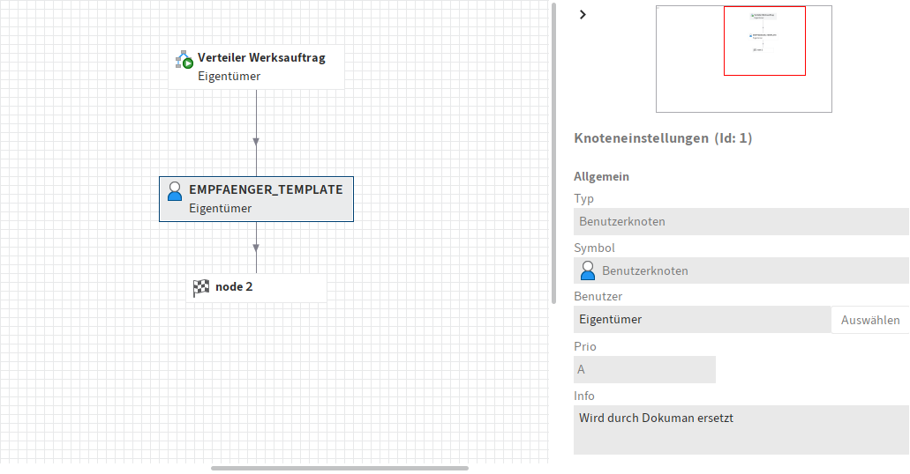

# ELO Distribution Workflow

Start an ELO workflow based on a predefined template and dynamically assign workflow nodes to users resolved from their email addresses.

> 🇩🇪 Dieses README ist auch auf [Deutsch verfügbar](README.de.md)

---

## ✨ Features

- Resolves ELO user IDs from email addresses
- Clones a workflow template and activates it
- Dynamically creates a workflow node for each user
- Connects all generated nodes to an existing target node (e.g., `node2`)
- Starts the workflow programmatically from an external application (e.g., Dokuman)

---

## ⚙️ Requirements

- The template workflow must contain a placeholder node named `EMPFAENGER_TEMPLATE`
- This node must already be connected to a target node (e.g., `node2`)
- The end node (target node) should **not** be manually modified or deleted

---

## 🧩 Technical Background

This solution replaces outdated email distribution lists with native ELO workflow structures. Each recipient receives their own workflow node, independent of others – allowing for parallel information distribution without triggering workflow completion prematurely (as would happen with ELO's ParallelNode).

This technique avoids:
- Group-based nodes where only the first recipient processes the task
- Manual acknowledgment or read receipts
- Outlook-based duplication and document scattering

---

## 🖼️ Workflow Preview

The following screenshot shows the ELO workflow template with a placeholder node and a target node (`node2`):



---

## 🧪 Example Usage

```vbnet
Dim flowId As Integer = StartVerteilerWorkflowAusTemplate(
    objId := "123456",
    workflowName := "Distribution: Engineering Task",
    emailAdressen := New List(Of String) From {
        "user1@example.com",
        "user2@example.com"
    }
)
