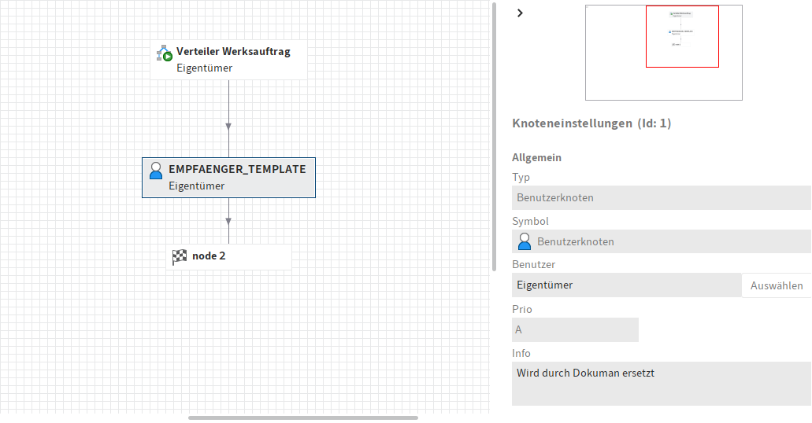

# ELO Verteilungs-Workflow

Startet einen ELO-Workflow basierend auf einer vorhandenen Vorlage und weist dynamisch Workflow-Knoten zu – basierend auf E-Mail-Adressen, die zu Benutzer-IDs aufgelöst werden.

> 🇬🇧 This README is also available in [English](README.md)

---

## ✨ Funktionen

- Ermittelt ELO-Benutzer-IDs aus E-Mail-Adressen
- Klont eine Workflow-Vorlage und aktiviert diese
- Erstellt für jeden Benutzer einen eigenen Knoten
- Verbindet alle neuen Knoten mit einem vorhandenen Zielknoten (z. B. `node2`)
- Startet den Workflow direkt aus einer Anwendung wie z. B. **Dokuman**

---

## ⚙️ Voraussetzungen

- Die Workflow-Vorlage enthält einen Platzhalterknoten mit dem exakten Namen `EMPFAENGER_TEMPLATE`
- Dieser Platzhalter muss bereits mit dem Zielknoten (`node2`) verbunden sein
- Der Endknoten darf **nicht** manuell verändert oder gelöscht werden

---

## 🧩 Hintergrund

Dieser Ansatz ersetzt Outlook-Verteilerlisten durch native ELO-Workflows. Jeder Empfänger erhält einen eigenen Knoten – unabhängig von den anderen. Es wird **kein paralleler Workflow** verwendet, bei dem der erste Bearbeiter alle anderen deaktiviert.

Vorteile:
- Keine Gruppenverteilung mit automatischem Abbruch
- Keine manuelle Lesebestätigung nötig
- Keine redundanten E-Mail-Kopien im Outlook

---

## 🖼️ Workflow-Vorschau

Der folgende Screenshot zeigt die ELO-Workflow-Vorlage mit dem Platzhalter und dem Zielknoten `node2`:



---

## 🧪 Beispielaufruf

```vbnet
Dim flowId As Integer = StartVerteilerWorkflowAusTemplate(
    objId := "123456",
    workflowName := "Verteilung Technischer Auftrag",
    emailAdressen := New List(Of String) From {
        "user1@example.com",
        "user2@example.com"
    }
)
